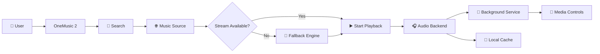

# 🎵 OneMusic 2

<p align="center">
  
  
  
  
</p>

<p align="center">
  <strong>An ad-free, cross-platform music streaming app built with Flutter.</strong>
</p>

<p align="center">
  🎧 Stream • 🔎 Discover • ▶️ Play • 💾 Cache • 📱 Background Audio
</p>

---

## 🎬 Demo

<p align="center">

<a href="YOUR_VIDEO_LINK">
  
</a>

</p>

> Replace `YOUR_VIDEO_LINK` with your demo video or upload a GIF to `assets/`.

---

## ✨ Features

- 🎧 Ad-free music experience
- 🔎 Music search & discovery
- ▶️ Audio playback
- 🎵 Background playback
- 📱 Media notification controls
- 🌐 Multi-source streaming
- ⚡ YouTube-based playback engine
- 💾 Local caching
- 🖼️ Network image caching
- 🔄 Streaming fallback support
- 📦 Cross-platform Flutter project

---

## 🔄 System Flow



---

## 🏗️ Architecture

```text
                    ┌─────────────────┐
                    │    OneMusic 2   │
                    └────────┬────────┘
                             │
             ┌───────────────┼───────────────┐
             ▼               ▼               ▼
        UI / Flutter     Music Search    Local Cache
             │               │
             │               ▼
             │        Streaming Sources
             │               │
             └───────────────┼───────────────┐
                             ▼               ▼
                     Audio Backend      Fallback Engine
                             │               │
                             └───────┬───────┘
                                     ▼
                              Background Audio
```

---

## 🧠 Core Engine

```text
Search
  ↓
Resolve Track
  ↓
Find Stream
  ↓
Streaming Engine
  ↓
Audio Backend
  ↓
Background Playback
  ↓
Cache / Resume
```

---

## 🛠️ Tech Stack

| Technology | Role |
|---|---|
| **Flutter** | Cross-platform UI |
| **Dart** | Application logic |
| **just_audio** | Audio playback |
| **audio_service** | Background audio |
| **just_audio_background** | Background media controls |
| **flutter_inappwebview** | Headless web/audio engine |
| **youtube_explode_dart** | Streaming fallback |
| **Hive** | Local storage/cache |
| **HTTP** | Network requests |
| **CachedNetworkImage** | Image caching |

---

## 📁 Project Structure

```text
onemusic2/
├── android/
├── assets/
├── ios/
├── lib/
│   ├── main.dart
│   ├── audio_backend.dart
│   ├── audio_handler.dart
│   └── yt_headless_bridge.dart
├── linux/
├── macos/
├── windows/
├── test/
├── pubspec.yaml
└── README.md
```

---

## 🚀 Run Locally

```bash
git clone https://github.com/AkshatRaj00/onemusic2.git
cd onemusic2

flutter pub get
flutter run
```

---

## 🎯 Highlights

```text
🎵 Ad-Free
⚡ Fast Playback
🌐 Multi-Source
📱 Background Audio
💾 Local Cache
🔄 Fallback Streaming
🖥️ Cross-Platform
```

---

## 🔮 Roadmap

- 🎼 Playlists
- ❤️ Favorites
- 📥 Offline downloads
- 🎚️ Equalizer
- 📊 Listening statistics
- ☁️ Cloud sync
- 🎨 More themes
- 🔐 User accounts

---

<p align="center">

### 🎧 OneMusic 2

<strong>Music without the noise.</strong>

<br/><br/>

⭐ If you like the project, consider giving it a star.

</p>
