# 🎵 OneMusic v2

<p align="center">
  
</p>

<p align="center">
  <strong>Flutter × Dart × Android × Audio Engine</strong>
</p>

<p align="center">
  🎧 Background Playback &nbsp;•&nbsp;
  ⚡ Headless Audio Pipeline &nbsp;•&nbsp;
  🔒 MediaSession &nbsp;•&nbsp;
  🎛️ Native Controls
</p>

---

## 🎬 Demo

<p align="center">
  
</p>

<p align="center">
  <a href="assets/demo/onemusic-demo.mp4">
    ▶️ Watch Full Demo
  </a>
</p>

---

# 🎧 Complete Audio Flow

```mermaid
flowchart LR

    USER["👤 USER"]
    UI["📱 FLUTTER UI"]
    HANDLER["🎧 AUDIO HANDLER"]
    BRIDGE["🌉 HEADLESS BRIDGE"]
    SOURCE["🌐 STREAM SOURCE"]
    BUFFER["📦 BUFFER"]
    PLAYER["⚡ AUDIO ENGINE"]
    OUTPUT["🔊 AUDIO OUTPUT"]

    USER --> UI
    UI --> HANDLER
    HANDLER --> BRIDGE
    BRIDGE --> SOURCE
    SOURCE --> BUFFER
    BUFFER --> PLAYER
    PLAYER --> OUTPUT
```

---

# 🏗️ Complete System Architecture

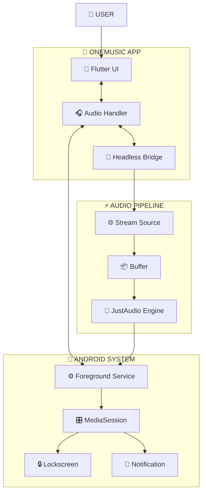

---

# 🔄 Playback Lifecycle

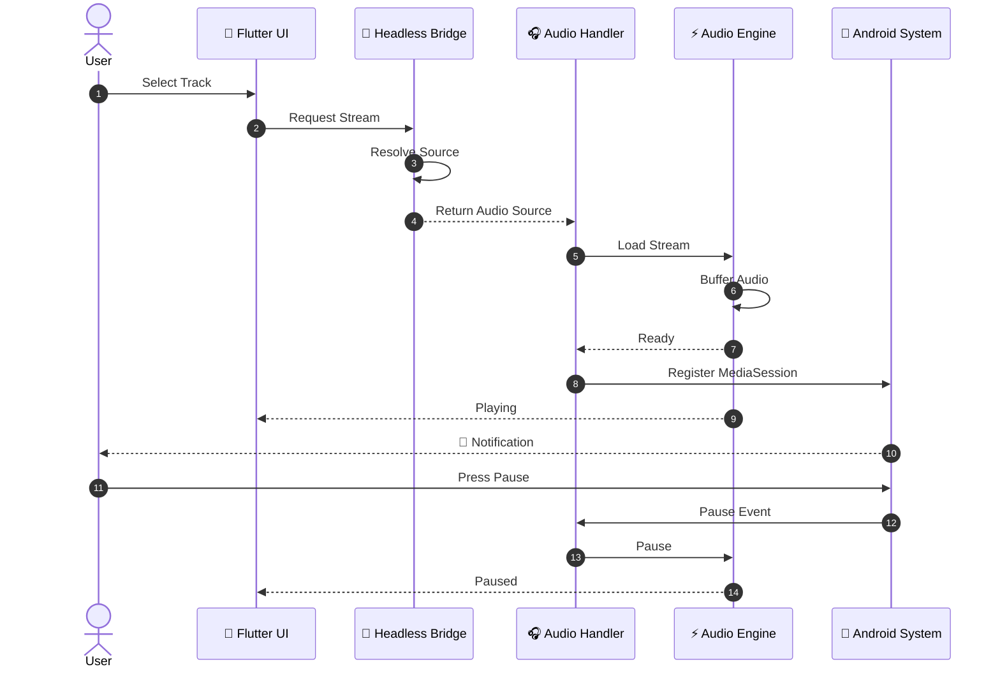

---

# 🧠 Playback State Machine

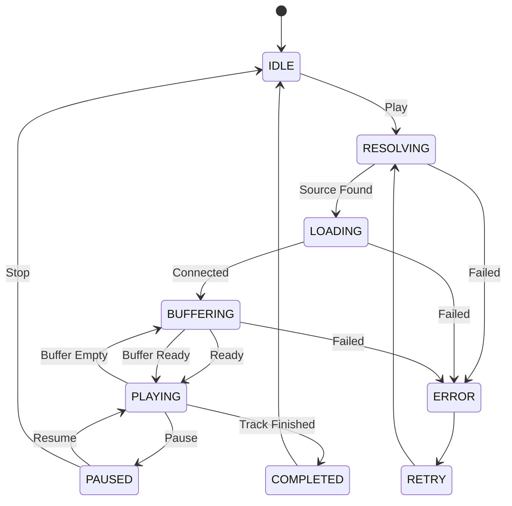

---

# 🌐 Stream Resolution Flow

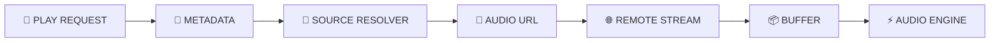

---

# 🔒 Background Playback

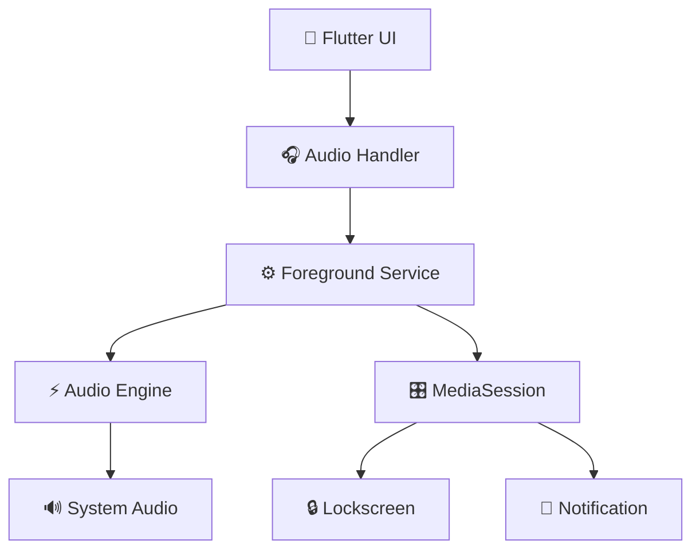

---

# 🎛️ Media Control Flow

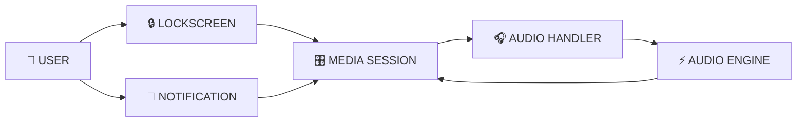

---

# ⚠️ Failure & Recovery Flow

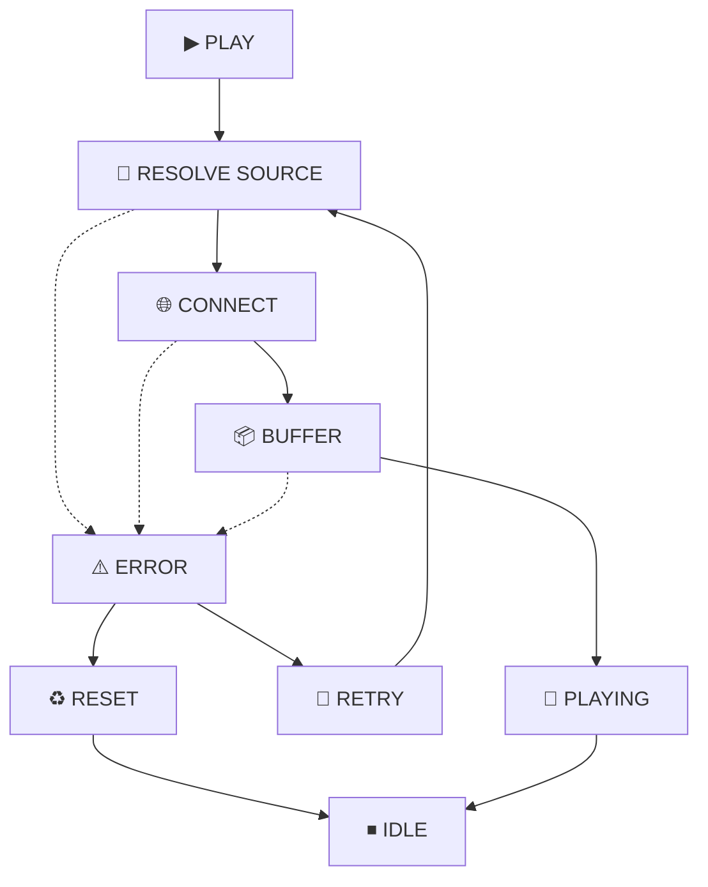

---

# 📡 Complete Data Flow

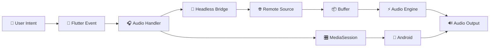

---

# 🧩 Module Relationship

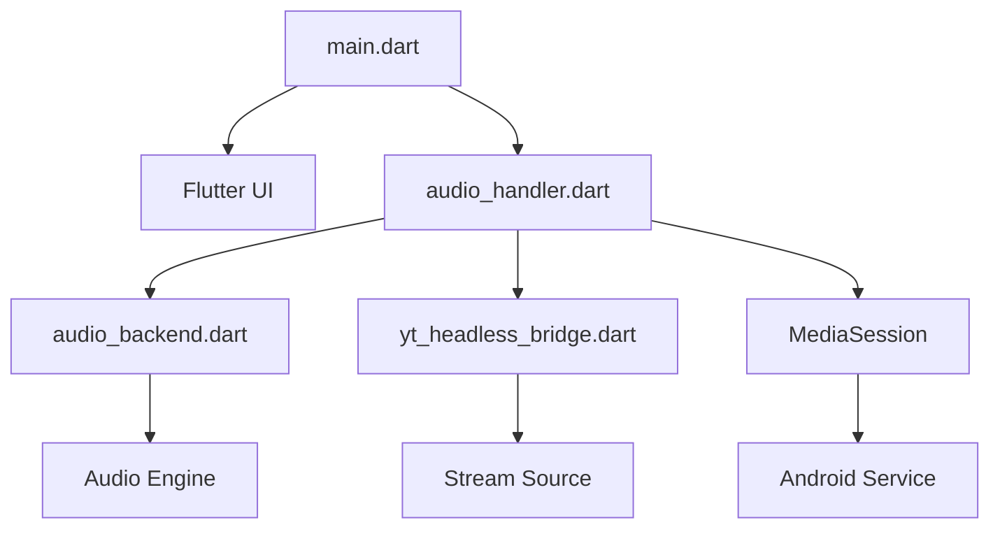

---

# 🚀 OneMusic Pipeline

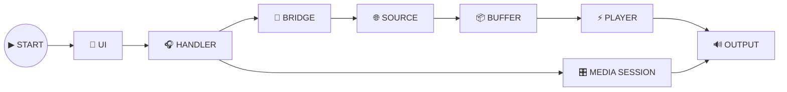

---

# 🎬 Visual Architecture

<p align="center">
  
</p>

<p align="center">
  
</p>

<p align="center">
  
</p>

---

# 📂 Project Structure

```text
onemusic2/
│
├── assets/
│   │
│   ├── hero/
│   │   └── onemusic-engine.gif
│   │
│   ├── demo/
│   │   ├── onemusic-preview.gif
│   │   └── onemusic-demo.mp4
│   │
│   └── architecture/
│       ├── system-architecture.gif
│       ├── playback-lifecycle.gif
│       └── data-flow.gif
│
├── lib/
│   ├── main.dart
│   ├── audio_backend.dart
│   ├── audio_handler.dart
│   └── yt_headless_bridge.dart
│
├── test/
│
├── pubspec.yaml
│
└── README.md
```

---

# 🛠️ Quick Start

```bash
git clone https://github.com/AkshatRaj00/onemusic2.git

cd onemusic2

flutter pub get

flutter analyze

flutter run
```

---

<p align="center">

### 🎵 OneMusic v2

**Flutter → Headless Bridge → Audio Engine → Android → 🔊**

</p>

<p align="center">
  Built for continuous audio.
</p>
